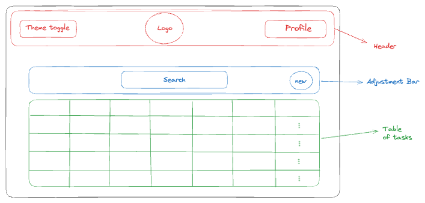

## Available Scripts

In the project directory, you can run:

### `npm start`

Runs the app in the development mode.\
Open [http://localhost:3000](http://localhost:3000) to view it in the browser.

The page will reload if you make edits.\
You will also see any lint errors in the console.

### `npm test`

Launches the test runner in the interactive watch mode.\
See the section about [running tests](https://facebook.github.io/create-react-app/docs/running-tests) for more information.

### `npm run build`

Builds the app for production to the `build` folder.\
It correctly bundles React in production mode and optimizes the build for the best performance.

The build is minified and the filenames include the hashes.\
Your app is ready to be deployed!

See the section about [deployment](https://facebook.github.io/create-react-app/docs/deployment) for more information.

# Specs
### UI Design (High Level):

## Features:
1. <b><u>Theme</u></b> - Support Dark & Light mode.
2. <b><u>Profile</u></b> - Dialog with the profile data.
3. <b><u>View Tasks</u></b> - Table presenting the list items.
4. <b><u>Create/Edit/Delete task</u></b> - Form dialog to create/edit or delete tasks(can use Formik or React Hook Form).
5. <b><u></u></b>
6. <b><u>Task Prioritization</u></b> - High, Medium, Low priority.
7. <b><u>Categories/Tags</u></b> - By categorized or tags tasks, the list will be organized for the user and allow filters and sorts.
8. <b><u>Search</u></b> - Implement search tasks with debounce.
9. <b><u>Persistence</u></b> - The ability to save tasks and load it later.
10. <b><u>Visual Feedback</u></b> - Animations and visual effects on specific tasks like completed or due date.
11. <b><u>Accessibility</u></b> - Support accessibility by keyboard navigation and screen readers.

## Future tasks:

- [ ] Filter - Filter out specific tasks.
- [ ] Virtualization/Pagination - In case of multiple items(Intersection Observer/x-page header). 
- [ ] Offline mode functionality- In case of an offline mode, save data into local storage such as LS/SS/IndexedDB and save it for later
- [ ] Live update - Polling/SSE/Websocket to get update when other users are changing tasks.
- [ ] Mentions - Ability to add mentions in tasks and to inform other users.
- [ ] Notifications - Send emails on collaborations or changes by tags or assignee changes for tasks - can be achieved by Mailchimp or any other vendor.
- [ ] Permission system - capability to implement roles like Admin, Editor, Viewer
- [ ] Comments - Ability to write comments on tasks, for collaborations, discussion and clarifications.
- [ ] Multiple Items - Capability to check more than one task and perform action like delete, change prioritization etc.
